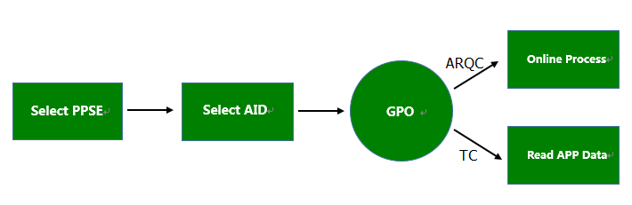

# QPboc-Kernel
Android NFC QPboc Support, for POS Developer.


# Features




# Delegate Interface 

## CoreAdapter  

PBOC Callback Adapter, Implement All UI Interface & Platform Dependent Interface.

1. _candidate_sel   
2. _cert_confirm
3. _acctype_sel
4. _iss_ref
5. _GetOfflinePin
6. _GetOnlinePin
7. _GetCashbackAmount
8. _GetTransAmount
9. _GenerateRandomInt

## IsoDepAdapter

ICC Dependent Interface, Support Apdu Communication. such as call Card Reader  Device. Default Implement by NFC.

```java
    /**
     * Apdu Communication
     *
     * Communication with the card should take place here.
     *
     * @param apdu  Apdu Command to Card
     * @param rsp  Card response
     * @return
     *         >0  sw eg. 0x9000
     *         <=  error code
     */
    @Override
    public int _ApduComm(ICCApdu apdu , ICCResponse rsp)
    {
        if (mIsoDep != null)
        {
            try
            {

                LogUtil.i(TAG, "ApduSend: [" + HexUtil.ByteArrayToHexString(apdu.build()) + "]");

                byte[] buf = mIsoDep.transceive(apdu.build());

                // If AID is successfully selected, 0x9000 is returned as the status word (last 2
                // bytes of the result) by convention. Everything before the status word is
                // optional payload, which is used here to hold the account number.
                int resultLength = buf.length;
                int sw = 0x0;

                if(resultLength >= 2)
                {
                    sw |= buf[resultLength - 2];
                    sw <<= 8;
                    sw |= buf[resultLength - 1] ;
                    sw &= 0xFFFF;
                }

                LogUtil.i(TAG, "ApduRecv: [" + HexUtil.ByteArrayToHexString(buf) + "] - sw -[" + String.format("%04X",sw) +"]");

                rsp.data = buf;
                rsp.sw = sw;

                return sw;

            } catch (IOException e) {
                LogUtil.e(TAG, "Error Communicating With Card: " + e.toString());
            }
        }

        return 0;
    }
```

# Examples

```java

    //初始化相关QPboc依赖的参数
    @Override
    protected void onCreate(Bundle savedInstanceState) {
        super.onCreate(savedInstanceState);
        setContentView(R.layout.activity_main);

        mAdapter=NfcAdapter.getDefaultAdapter(this);
        if(mAdapter==null)
        {
            Toast.makeText(this, "No NFC found on this device", Toast.LENGTH_SHORT).show();
            finish();
            return;
        }

        mPendingIntent = PendingIntent.getActivity(this, 0, new Intent(this, getClass()).addFlags(Intent.FLAG_ACTIVITY_SINGLE_TOP), 0);

        mICC = new IsoDepAdapter();
        mCoreAdapter = new CoreAdapter(this);

        mQPboc = new QPboc(mICC,mCoreAdapter);

        //for test
        mQPboc.setParam("123456789012345","12345678","BCTC","FFFFFFFF");

        String field62 = "9F0608A000000333010101DF0101009F08020020DF1105D84000A800DF1205D84004F800DF130500100000009F1B0400000001DF150400000000DF160199DF170199DF14039F3704DF1801019F7B06000000100000DF1906000000100000DF2006000000100000DF2106000000100000";
        //载入一个AID参数
        mQPboc.updateAid(field62,true);

    }   

	//调用方法
	void onReadCard(Intent intent) {
        // Parse the intent
        String action = intent.getAction();
        final Context mContext = this;

        //银行卡返回的ACTION 为 ACTION_TAG_DISCOVERED
        if (NfcAdapter.ACTION_TAG_DISCOVERED.equals(action))
        {

            Tag tagFromIntent = getIntent().getParcelableExtra(NfcAdapter.EXTRA_TAG);

            //do something with Ndef Record
            System.out.println(tagFromIntent);

            mICC.onTagDiscovered(tagFromIntent);

            //调用内核
            mQPboc.onTransactionProcess((byte)0x0,1,new QCallback() {

                @Override
                public void onAccept() {
                    Toast.makeText(mContext, "QPBOC Accept",Toast.LENGTH_LONG).show();
                }

                @Override
                public void onDecline() {
                    Toast.makeText(mContext, "QPBOC Decline",Toast.LENGTH_LONG).show();

                }

                @Override
                public void onOnline() {
                    byte[] filed55 = mQPboc.getField55();

                    Toast.makeText(mContext, "QPBOC Online",Toast.LENGTH_LONG).show();

                }

                @Override
                public void onTermination(int errCode)
                {
                    Toast.makeText(mContext, "QPBOC Termination - " + errCode ,Toast.LENGTH_LONG).show();

                }
            });

        } else {
            // Unknown tag type
            Toast.makeText(this, "TNF_UNKNOWN",Toast.LENGTH_LONG).show();
        }
    }

```


## Demo


## License

MIT
